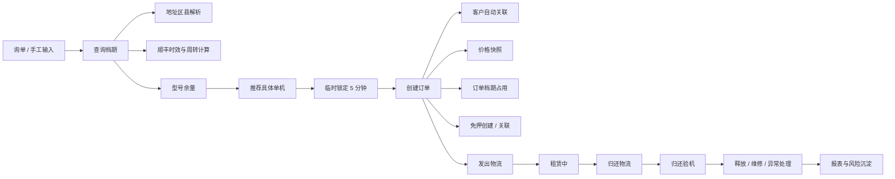

# 租赁核心业务流 V2

本文档是小狗相机助手商户版的项目级业务逻辑真源，用于约束后续 Codex 会话、UI 设计、数据库设计、safeOps 写操作和验收口径。

## 1. 文档边界

### 1.1 当前阶段

- 当前阶段：Phase 04 - Operation Safe Mode。
- 本文只定义业务流、状态口径、关联关系和后续实现约束。
- 本文不代表本轮已经实现对应功能。
- 本文不开放真实顺丰、免押、闲鱼或其它外部 API。
- 本文不要求本轮修改数据库、业务代码、IPC、Python、mobile 或 launcher。

### 1.2 产品定位

小狗相机助手商户版是面向租赁商家的订单、档期、设备、物流、免押、员工协作和经营数据管理系统。闲鱼只是订单来源之一，不是未来产品中心。

### 1.3 总体原则

```text
架构按未来 SaaS 设计；
功能按当前内部提效落地；
UI 按设计系统统一；
数据按多商户预留；
商户协作先规划，不提前开发；
每个阶段独立验收，验收通过再进入下一阶段。
```

## 2. 核心对象与关联

### 2.1 对象分层

| 层级 | 对象 | 定义 | 关键关系 |
|---|---|---|---|
| 商户层 | Merchant | 一个租赁商户主体 | 下挂门店、账号、设备、订单、配置 |
| 门店层 | Store | 发货、回仓、库存管理的运营节点 | 设备所属门店、发货门店、员工默认门店 |
| 账号层 | Actor / Staff | 操作人员 | 带 actorId、role、merchantId、storeId |
| 型号层 | Device Model | 对外售卖的租赁型号 | 价格规则、残值、默认押金、可用门店、库存 |
| 单机层 | Device Unit | 一台真实设备 | 序列号、所属门店、状态、当前订单、下一预约 |
| 档期层 | Schedule / Lock | 设备占用窗口 | 来源于临时锁定、订单、维修、人工锁定 |
| 订单层 | Rental Order | 履约主单 | 绑定客户、设备、租期、价格快照、押金、物流、验机 |
| 客户层 | Customer | 租赁用户 | 手机号强匹配，姓名+区县弱匹配 |
| 免押层 | Deposit Review | 外部或本地免押审核单 | 绑定订单，跟踪免押创建、通过、完结 |
| 物流层 | Shipment | 发出物流和归还物流 | 可关联订单、设备、门店、顺丰预览 |
| 验机层 | Inspection | 归还验收结果 | 决定设备状态、订单完成、免押完结和客户风险 |
| 报表层 | Reports | 经营汇总视图 | 只从已对齐的业务对象聚合 |

### 2.2 关联总图



### 2.3 聚合根

订单是履约聚合根，但不是所有状态都塞进一个字段。订单详情页必须聚合展示：

- 主业务状态；
- 押金 / 免押状态；
- 发出物流状态；
- 归还物流状态；
- 验机状态；
- 支付状态；
- 设备档期状态；
- 下一步动作。

## 3. 查询档期

### 3.1 查询输入

查询档期只需要以下信息：

| 字段 | 必填 | 说明 |
|---|---:|---|
| 设备型号 | 是 | 用户只选择型号，不手工选择具体单机 |
| 租期 | 是 | 开始日期和结束日期 |
| 模糊目的地区域 | 是 | 最低识别到区 / 县 |
| 发货门店 | 是 | 用于计算发货城市、门店库存和顺丰时效 |

### 3.2 查询阶段不得要求的信息

查询档期阶段不要求：

- 姓名；
- 手机号；
- 详细门牌地址；
- 身份证或其它敏感信息；
- 完整客户资料。

查询档期阶段不创建客户，不保存完整个人信息。可以保存脱敏的查询日志、区县级地址、员工、门店、型号、租期和结果摘要，用于复盘和转订单。

### 3.3 模糊地址解析

模糊地址解析必须满足：

| 规则 | 要求 |
|---|---|
| 最低颗粒度 | 必须识别到区 / 县 |
| 只输入城市 | 不允许直接查档期，提示选择区县 |
| 输入镇 / 乡 / 村 | 系统应识别其所属区 / 县 |
| 候选项 | 解析不唯一时提供候选区县，员工选择后再查询 |
| 结果字段 | 省、市、区县、镇乡街道、置信度、候选项 |
| 隐私边界 | 不保存门牌号，不创建客户 |

地址解析结果建议结构：

```json
{
  "province": "广东省",
  "city": "深圳市",
  "district": "南山区",
  "township": "粤海街道",
  "confidence": 0.92,
  "candidates": [
    {
      "province": "广东省",
      "city": "深圳市",
      "district": "南山区",
      "township": "粤海街道",
      "confidence": 0.92
    }
  ],
  "sourceTextMasked": "深圳南山***"
}
```

### 3.4 档期计算必须覆盖的时间因素

查询档期不是只看租期开始和结束，还必须计算完整物流占用窗口。

| 时间点 | 定义 |
|---|---|
| 租期开始日 | 客户开始使用设备的日期 |
| 必须送达日 | 租期开始前一天 |
| 上午发货时点 | 发货日 10:00 |
| 下午发货时点 | 发货日 18:00 |
| 顺丰时效 | 根据发货门店、目的地区县、产品类型和节假日风险计算 |
| 最晚发货时间 | 能保证租期开始前一天送达的最后可发货时点 |
| 前一单预计回仓时间 | 前一客户寄回或线下归还后的设备预计到店时间 |
| 验机缓冲 | 检查外观、功能、配件、电池、存储卡、充电器 |
| 清洁缓冲 | 清洁机身、镜头、配件、包装 |
| 充电缓冲 | 设备电池和备用电池充满 |
| 打包缓冲 | 贴单、装箱、拍照、出库确认 |
| 客户返程物流 | 设备从客户返回门店的运输时间 |
| 设备重新可租时间 | 回仓 + 验机 + 清洁 + 充电 + 打包后的下一次可发货时间 |

### 3.5 发出物流计算规则

查询档期时必须默认计算两个发货候选：

| 候选 | 含义 | 用途 |
|---|---|---|
| 10:00 发货 | 当天上午出库 | 判断常规安全发货能力 |
| 18:00 发货 | 当天下午截止出库 | 判断当天是否仍可赶上时效 |

系统必须给出：

- 推荐发货日；
- 推荐发货时点；
- 最晚发货时间；
- 是否需要提前一天发货；
- 是否需要半日达、同城急送或人工确认；
- 顺丰时效置信度；
- 节假日、天气、偏远区县、时效接口不可用等风险提示。

### 3.6 归还与再出租计算规则

设备结束一单后不能立即默认可租。必须计算：

```text
上一单租期结束
-> 客户寄回 / 线下归还
-> 预计回仓
-> 验机
-> 清洁
-> 充电
-> 打包
-> 可再次发货
-> 下一单必须送达
```

如下一单要求租期开始前一天送达，则下一单的设备占用窗口必须从发货准备时点开始，而不是从租期开始日开始。

### 3.7 查询结果分类

查询结果必须分为四类：

| 分类 | 定义 | 员工动作 |
|---|---|---|
| 安全可用 | 物流和周转时间均满足，风险低 | 可直接临时锁定并继续创单 |
| 风险可用 | 基本可满足，但存在时效、回仓、缓冲或节假日风险 | 可锁定，但必须显示风险和人工确认入口 |
| 需人工确认 | 数据不完整、地址候选不唯一、顺丰时效不确定、跨门店调拨或前一单回仓不稳 | 不自动承诺客户，先人工判断 |
| 无档期 | 没有任何单机能满足完整物流占用窗口 | 推荐其它型号、其它门店、其它租期 |

### 3.8 单机推荐

用户只选择型号，系统自动推荐具体单机。推荐逻辑按以下优先级：

1. 完整物流窗口安全可用；
2. 发货门店本店单机优先；
3. 前一单回仓最早且缓冲充足；
4. 避免频繁跨门店调拨；
5. 避免连续高强度出租的设备；
6. 优先选择状态稳定、近期无异常维修记录的设备；
7. 多台相同评分时，按内部设备编号稳定排序，避免多人看到不同默认结果。

## 4. 临时锁定

### 4.1 触发

查询有档期后，系统自动锁定推荐单机。默认锁定 5 分钟，允许系统配置为 3 到 5 分钟。

锁定用于防止多个客服同时把同一台设备承诺给不同客户。

### 4.2 锁定记录字段

临时锁定记录必须包含：

| 字段 | 说明 |
|---|---|
| lockId | 锁定唯一编号 |
| merchantId | 商户 |
| storeId | 所属 / 发货门店 |
| actorId | 操作员工 |
| role | 操作角色 |
| modelCode | 型号 |
| unitId | 推荐具体单机 |
| rentStartDate / rentEndDate | 租期 |
| occupationStartAt / occupationEndAt | 完整物流占用窗口 |
| queryAddress | 区县级查询地址，不含门牌号 |
| addressParseResult | 省市区县、镇乡街道、置信度、候选项 |
| sfEstimate | 顺丰时效结果、产品建议、置信度 |
| riskLevel | 安全可用 / 风险可用 / 需人工确认 |
| expiresAt | 到期时间 |
| status | 锁定状态 |
| source | 查询页、订单页、客服会话等 |

### 4.3 锁定状态

| 状态 | 说明 | 释放规则 |
|---|---|---|
| 锁定中 | 已占用但未成单 | 到期释放、手动释放、转订单 |
| 已转订单 | 已创建正式订单 | 不再作为临时锁定释放 |
| 已过期释放 | 到期后自动释放 | 保留审计记录 |
| 手动释放 | 员工主动释放 | 必须记录 actorId 和原因 |

### 4.4 并发规则

临时锁定必须防并发：

- 同一 merchantId、unitId、时间窗口内只能有一个有效锁；
- 创建锁定时必须重新检查当前有效订单档期和有效临时锁；
- 锁定写入必须具备幂等键，避免员工重复点击创建多个锁；
- 转订单时必须校验 lockId 仍然有效；
- 锁定过期释放不能删除历史，只能更新状态；
- 强制忽略冲突必须走审批，记录 approvedBy 和原因。

### 4.5 锁定延长和释放

- 锁定中可延长一次，默认再延长 5 分钟；
- 延长必须重新检查设备仍无正式订单冲突；
- 超过延长次数后只能重新查档期；
- 员工离开页面时不自动释放，避免误释放；
- 员工明确取消沟通、客户放弃、改型号或改租期时，应手动释放。

## 5. 创建订单

### 5.1 创建入口

创建订单支持三种入口：

| 入口 | 说明 |
|---|---|
| 从临时锁定创建 | 推荐主路径，复用锁定的设备、租期、物流窗口 |
| 复用最近查询结果创建 | 查询结果还有效但未形成锁定时，重新校验后创建 |
| 直接新建订单 | 老客户、线下订单或补录订单，仍必须先做档期校验或人工覆盖 |

### 5.2 创建订单四步

| 步骤 | 页面含义 | 核心校验 |
|---|---|---|
| 1. 档期与设备 | 选择型号、租期、发货门店，确认推荐单机和锁定 | 锁定有效、无档期冲突 |
| 2. 客户与地址 | 粘贴完整收货信息，解析姓名、手机号、省市区县、详细地址 | 隐私字段只在订单阶段保存 |
| 3. 价格与押金 | 计算租金、押金 / 免押金额，允许有原因地人工调整 | 价格快照、调整原因、审批规则 |
| 4. 确认创建 | 展示完整订单摘要、风险、下一步动作 | 二次确认、幂等、防重复订单 |

### 5.3 客户信息采集

创建订单时才粘贴完整客户收货信息：

- 姓名；
- 手机号；
- 省；
- 市；
- 区县；
- 详细地址。

系统自动解析收货信息，并自动创建或关联客户：

| 情况 | 处理 |
|---|---|
| 手机号存在且唯一匹配客户 | 关联该客户 |
| 手机号存在但匹配多个客户 | 员工选择客户，系统记录合并风险 |
| 手机号不存在 | 创建新客户 |
| 手机号缺失 | 用姓名 + 区县弱匹配候选客户，并标记“资料不完整” |
| 地址解析不完整 | 阻止普通创单，允许管理员人工覆盖并记录原因 |

### 5.4 订单渠道

订单渠道必须支持：

- 闲鱼；
- 小红书；
- 微信私域；
- 抖音；
- 线下；
- 手工录入；
- 其他。

渠道是订单来源，不得把闲鱼设计成系统主模型。

### 5.5 租金规则

租金默认从型号价格规则计算。

订单创建时必须保存价格快照：

- 型号；
- 租期；
- 基础租金规则；
- 续租价格规则；
- 优惠或活动；
- 手动调整金额；
- 手动调整原因；
- 操作员工；
- 审批人；
- 创建时的规则版本。

手动修改租金必须记录原因。大幅修改租金必须审批。

### 5.6 押金 / 免押金额

默认押金或免押金额来自型号当前残值或默认押金规则。

当员工手动调整押金 / 免押金额时，系统必须提示三个选项：

| 选项 | 含义 | 审批 |
|---|---|---|
| 仅本单使用 | 不改变型号残值，只保存订单押金快照 | 小额调整可由店长授权 |
| 同步更新该型号残值 | 修改型号后续默认押金依据 | 必须管理员审批 |
| 提交管理员审核 | 当前订单暂存，等待审批 | 必须记录 approvedBy |

### 5.7 创单后的标准下一步

创单成功后，系统必须给出下一步动作：

| 条件 | 下一步动作 |
|---|---|
| 需要免押且未创建免押 | 创建免押单 |
| 需要押金且未收 | 收取押金 |
| 已免押通过 / 已收押金，未发货 | 创建发出物流 |
| 有档期风险 | 人工确认档期和物流 |
| 信息不完整 | 补全客户资料 |

## 6. 免押

### 6.1 创建入口

免押创建入口：

- 从订单创建；
- 免押管理中手动创建。

### 6.2 从订单创建时自动带入

从订单创建免押时必须自动带入：

- 订单号；
- 手机号；
- 型号；
- 租期；
- 租金；
- 型号残值；
- 免押金额；
- 客户姓名；
- 门店；
- 操作员工；
- 价格和押金快照版本。

敏感字段在 preview 和日志中必须脱敏。

### 6.3 未关联免押单关联订单

未关联免押单需要支持关联订单。候选订单推荐按以下权重：

1. 手机号；
2. 设备型号；
3. 租期；
4. 租金；
5. 免押金额；
6. 创建时间；
7. 渠道；
8. 门店。

关联时必须展示匹配原因和冲突风险，不允许静默自动关联到低置信度订单。

### 6.4 免押状态

免押状态独立于订单主状态：

| 状态 | 含义 | 下一步 |
|---|---|---|
| 未创建 | 订单需要免押但未创建 | 创建免押 |
| 已创建 | 已生成免押单 | 等待客户提交 / 平台审核 |
| 审核中 | 外部或人工审核中 | 跟进客户或刷新状态 |
| 已通过 | 可进入发货前置条件 | 创建发出物流 |
| 已拒绝 | 免押失败 | 收押金或取消订单 |
| 已取消 | 免押单取消 | 重新创建或改押金 |
| 可完结 | 归还验机正常，无争议 | 完结免押 |
| 已完结 | 免押流程结束 | 订单可完成归档 |
| 异常 | 金额、订单、客户或平台状态异常 | 人工处理 |

### 6.5 完结条件

验机完成后，且无以下情况，才提示完结免押：

- 损坏；
- 配件缺失；
- 欠费；
- 逾期争议；
- 设备异常待确认；
- 客户风险未处理；
- 归还物流未确认。

真实免押创建、完结和状态刷新必须经 external gateway 控制，默认不得开启 real mode。

## 7. 物流与顺丰

### 7.1 物流类型

物流必须分为：

| 类型 | 含义 |
|---|---|
| 发出物流 | 商家把设备发给客户 |
| 归还物流 | 客户把设备寄回商家或线下归还 |

两者不能共用一个状态字段。

### 7.2 发货入口

发货入口：

- 从订单创建；
- 物流管理手动创建；
- 手动创建后可关联订单。

### 7.3 从订单发货自动带入

从订单发货时自动带入：

- 订单号；
- 客户收货信息；
- 设备型号；
- 具体设备；
- 发货门店；
- 默认寄件人信息；
- 推荐顺丰产品；
- 最晚发货时间；
- 是否存在时效风险。

### 7.4 顺丰寄件类型

顺丰寄件可选择：

- 普通快递；
- 顺丰标快；
- 半日达；
- 同城急送；
- 其他。

真实顺丰下单仍需 external gateway 控制，不能默认开启。任何真实顺丰调用必须具备：

- preview；
- confirmToken；
- idempotencyKey；
- audit；
- external mode；
- 失败补偿；
- 费用归集；
- 敏感字段脱敏。

### 7.5 归还方式

归还支持：

| 方式 | 说明 |
|---|---|
| 上传寄回单号 | 客户提供快递单号 |
| 不上传单号 | 客户未提供或平台不可查 |
| 线下归还 | 客户到店归还 |
| 手动标记已归还 | 特殊情况由员工确认，必须记录原因 |

### 7.6 订单取消补偿

订单取消时必须按当前阶段补偿：

| 当前进度 | 需要处理 |
|---|---|
| 临时锁定 | 释放锁定 |
| 未发货 | 释放档期，取消免押或退押金 |
| 已发货 | 阻止普通取消，必须管理员审批 |
| 租赁中 | 不能直接取消，走提前归还或异常 |
| 归还中 | 继续跟踪归还和验机 |
| 已完成 | 不允许取消，只能售后备注 |

取消已发货订单必须审批。

## 8. 归还验收

### 8.1 验机入口

归还后进入验机。入口包括：

- 订单详情的“开始验机”；
- 物流归还完成后的下一步动作；
- 设备详情的待验机提示；
- 工作台今日待办。

### 8.2 验机结果

验机结果：

| 结果 | 含义 | 设备状态影响 | 订单影响 | 免押影响 |
|---|---|---|---|---|
| 正常入库 | 设备和配件完整 | 可用 / 待打包 | 可完成 | 可完结 |
| 需要清洁 | 外观或包装需处理 | 清洁中 | 暂不完成 | 暂不完结 |
| 需要维修 | 功能问题需维修 | 维修中 | 异常或待处理 | 暂不完结 |
| 设备异常 | 状态不确定 | 异常 | 异常 | 暂不完结 |
| 丢失 / 损坏 | 设备或配件损失 | 丢失 / 维修 / 报废 | 异常 | 不可完结，进入赔付 |

### 8.3 验机影响

验机结果影响：

- 设备状态；
- 订单是否完成；
- 客户风险；
- 免押是否可完结；
- 后续档期是否释放；
- 设备是否可再次出租；
- 报表中的异常和损失统计。

### 8.4 后续档期处理

| 验机结果 | 后续档期处理 |
|---|---|
| 正常入库 | 按清洁 / 充电 / 打包缓冲后释放 |
| 需要清洁 | 延后释放，生成清洁任务 |
| 需要维修 | 阻断后续可租，标记冲突订单 |
| 设备异常 | 进入人工确认，不自动释放 |
| 丢失 / 损坏 | 后续档期全部需人工处理 |

## 9. 订单状态模型

### 9.1 状态拆分

订单状态不能只用一个字段承担全部语义。必须拆为：

| 状态维度 | 说明 |
|---|---|
| 主业务状态 | 订单生命周期 |
| 押金 / 免押状态 | 押金收取、免押创建、审核和完结 |
| 发出物流状态 | 从商家到客户 |
| 归还物流状态 | 从客户回商家 |
| 验机状态 | 归还后设备检查 |
| 支付状态 | 租金、押金、赔付、退款 |

### 9.2 主业务状态与下一步动作

| 主业务状态 | 定义 | 下一步动作建议 |
|---|---|---|
| 临时锁定 | 已锁定设备但未成单 | 补客户信息并创建订单，或释放锁定 |
| 待确认 | 订单草稿或信息待确认 | 确认客户、地址、价格、档期 |
| 待押金 / 免押 | 订单已确认但履约前置未完成 | 创建免押或收押金 |
| 待发货 | 押金 / 免押满足，等待出库 | 创建发出物流并打包 |
| 已发货 | 已发出，等待客户收货 | 跟踪物流，异常提醒 |
| 租赁中 | 客户使用设备中 | 到期提醒、续租、归还指引 |
| 待归还 | 租期结束或即将结束 | 提醒客户寄回或线下归还 |
| 归还运输中 | 客户已寄回 | 跟踪归还物流 |
| 已归还待验机 | 设备已回仓未验机 | 开始验机 |
| 已完成 | 验机正常、费用清算、免押完结 | 归档、客户复购 |
| 已取消 | 订单终止 | 释放资源、记录原因 |
| 异常 | 任一关键环节异常 | 进入人工处理 |

### 9.3 状态流转原则

- 主业务状态只表达履约阶段。
- 免押、物流、验机、支付都有自己的状态。
- 下一步动作由多个状态综合生成，而不是只看主状态。
- 任一状态被人工覆盖必须记录原因。
- 强制跳过档期冲突、强制取消已发货订单、强制完结免押必须审批。

## 10. 设备与价格规则

### 10.1 设备两层模型

设备分两层：

| 层级 | 说明 |
|---|---|
| 型号 | 面向销售和定价的产品，如 Sony A7M4 套餐 |
| 单机 | 一台真实设备，如 unitCode、serialNo 对应的一台相机 |

### 10.2 型号管理

型号管理字段：

- 型号名称；
- 型号编码；
- 购买价格；
- 当前残值；
- 默认押金；
- 租金规则；
- 续租价格；
- 免押门槛；
- 可用门店；
- 总库存；
- 是否启用；
- 价格规则版本；
- 最近更新时间；
- 更新人。

型号残值影响默认押金和免押金额。修改型号残值必须审批。

### 10.3 单机管理

单机管理字段：

- 设备编号；
- 序列号；
- 型号；
- 所属门店；
- 当前状态；
- 当前订单；
- 下一预约；
- 当前锁定；
- 维修记录；
- 内部备注；
- 采购成本；
- 当前残值快照；
- 最近验机结果。

### 10.4 单机状态

建议单机状态：

| 状态 | 含义 |
|---|---|
| 可用 | 可被推荐和锁定 |
| 临时锁定 | 被短时间占用，等待转订单 |
| 已预约 | 已有未来订单占用 |
| 发货准备中 | 打包、贴单、出库 |
| 运输中 | 发出或归还物流中 |
| 租赁中 | 客户使用中 |
| 待验机 | 已回仓但未验机 |
| 清洁中 | 需要清洁 |
| 充电中 | 需要充电 |
| 维修中 | 不可出租 |
| 下架 | 不参与出租 |
| 异常 | 需要人工确认 |
| 丢失 / 报废 | 不可出租 |

## 11. 多账号和权限预埋

### 11.1 商户、门店、账号

一个商户可以有多个门店和多个账号。

所有关键动作必须预留：

- actorId；
- role；
- merchantId；
- storeId；
- approvedBy；
- reason；
- createdAt；
- updatedAt。

### 11.2 角色

角色：

| 角色 | 典型权限 |
|---|---|
| 店主 | 全局配置、审批、报表、外部接口开关 |
| 管理员 | 大部分业务管理和审批 |
| 店长 | 本门店订单、设备、发货和部分价格审批 |
| 客服 | 查档期、锁定、创单、创建免押、客户沟通 |
| 仓库 / 履约 | 发货、归还、验机、设备状态 |
| 财务 / 风控 | 押金、免押、赔付、异常客户 |
| 只读查看 | 查看业务，不执行写操作 |

### 11.3 需要审批的动作

需要审批的动作：

- 大幅修改租金；
- 修改设备残值；
- 修改押金金额；
- 跨门店调拨；
- 强制忽略档期冲突；
- 开启真实外部接口；
- 取消已发货订单；
- 强制完结免押；
- 手动标记异常订单完成；
- 批量释放或重建档期。

## 12. 系统必须额外考虑的点

以下点必须进入后续设计和实现，不得遗漏：

| 事项 | 业务要求 |
|---|---|
| 返程物流时间 | 影响设备重新可租时间，不能只看租期结束日 |
| 验机、清洁、充电、打包缓冲 | 影响下一单能否安全发货 |
| 自取 / 自还场景 | 物流时效不同，但仍需出库、归还、验机记录 |
| 跨门店调拨 | 影响库存、时效、成本和审批 |
| 临时锁定并发 | 防止多个客服同时承诺同一台设备 |
| 锁定延长和释放 | 避免占用过久或误释放 |
| 订单取消补偿 | 释放锁定 / 档期、处理免押 / 押金 / 物流 |
| 改期 / 续租 | 必须重新计算档期冲突和价格快照 |
| 设备异常 | 阻断后续可租，影响客户风险和免押完结 |
| 人工覆盖原因 | 所有跳过系统建议的动作都必须记录原因 |
| 发出物流和归还物流分离 | 两套状态、两套时间、两套异常处理 |
| 价格快照 | 历史订单不随当前型号价格变化 |
| 客户隐私 | 查询阶段不保存完整个人信息，日志脱敏 |
| 节假日 / 时效接口不确定性 | 时效置信度低时进入风险可用或人工确认 |
| 每一步完成后的下一步动作提示 | 降低新员工操作成本，减少漏步骤 |

## 13. 改期和续租

### 13.1 改期

改期必须重新计算：

- 发出物流窗口；
- 归还物流窗口；
- 当前设备冲突；
- 临时锁定冲突；
- 下一单影响；
- 租金差额；
- 押金 / 免押是否需要调整；
- 客户通知。

改期不得直接覆盖原始价格和档期，必须保留变更记录。

### 13.2 续租

续租必须检查：

- 当前设备后续是否已被预约；
- 续租后是否影响下一单发货；
- 续租价格规则；
- 押金 / 免押是否覆盖延长租期；
- 客户是否有逾期或异常风险。

## 14. 自取、自还和线下场景

自取 / 自还不等于没有履约流程。

| 场景 | 必须记录 |
|---|---|
| 自取 | 取件时间、取件门店、取件人、出库验机、员工 |
| 自还 | 归还时间、归还门店、接收员工、验机结果 |
| 线下归还 | 可无快递单号，但必须有归还确认 |
| 线下取消 | 必须释放档期和锁定 |

## 15. 报表口径

报表只能从已对齐的业务对象汇总：

- 订单收入以订单价格快照为准；
- 押金 / 免押以押金维度状态为准；
- 设备利用率以完整占用窗口为准，不只看租期；
- 物流效率区分发出物流和归还物流；
- 异常率来自订单异常、验机异常、设备异常和物流异常；
- 渠道分析以订单渠道为准，不以具体平台逻辑为主；
- 员工效率以 actorId 的动作日志为准。

## 16. 后续实现的统一契约

后续实现必须遵守：

1. 任何真实写操作进入 safeOps。
2. 查询档期阶段不采集完整客户隐私。
3. 创单必须绑定价格快照。
4. 临时锁定必须防并发。
5. 订单主状态、免押状态、发出物流状态、归还物流状态、验机状态、支付状态必须拆分。
6. 发出物流和归还物流必须分离建模。
7. 免押真实接口和顺丰真实接口默认 disabled。
8. 人工覆盖必须记录原因和操作者。
9. 审批动作必须记录 approvedBy。
10. 报表不得绕过业务主对象自行猜状态。
